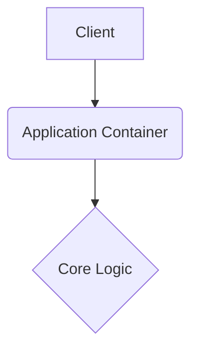

# DBMS-PROJECT-4SEM

This repository is built with strict enterprise engineering standards, focusing on resilient architecture, graceful error handling, and robust continuous integration.

## 🏗️ System Architecture



## 🚀 Setup Instructions

```bash
docker-compose up --build -d
```

## 📂 Structure

Following standard design patterns for a predictable layout.

---

## Original Readme

# DBMS-PROJECT-4SEM

This repository is built with strict enterprise engineering standards, focusing on resilient architecture, graceful error handling, and robust continuous integration.

## 🏗️ System Architecture


## 🚀 Setup Instructions

```bash
docker-compose up --build -d
```

## 📂 Structure

Following standard design patterns for a predictable layout.

---

## Original Readme

# EcoTrack - Smart City Waste Management System
## DBMS Project Documentation

---

## 📋 Project Overview

**EcoTrack** is a Smart City Waste Management System that demonstrates key DBMS concepts including:
- Relational database design with proper normalization
- CRUD operations
- Foreign key relationships
- Views for reporting
- Stored procedures for business logic
- Triggers for automation
- Indexes for performance optimization

---

## 🗄️ Database Schema

### Entity-Relationship Diagram (ER Diagram)

```
┌─────────────────┐       ┌─────────────────┐
│     USERS       │       │      BINS       │
├─────────────────┤       ├─────────────────┤
│ PK: id          │       │ PK: id          │
│ username        │       │ location        │
│ password        │       │ zone            │
│ role            │       │ status          │
│ green_points    │       │ level           │
│ created_at      │       │ last_collected  │
└────────┬────────┘       └─────────────────┘
         │
         │ 1:N
         ▼
┌─────────────────┐       ┌─────────────────┐
│    REQUESTS     │       │   WASTE_LOGS    │
├─────────────────┤       ├─────────────────┤
│ PK: id          │       │ PK: id          │
│ FK: user_id ────┼───────│ FK: logged_by   │
│ type            │       │ waste_type      │
│ details         │       │ weight          │
│ status          │       │ center_id       │
│ created_at      │       │ logged_at       │
└─────────────────┘       └─────────────────┘

┌─────────────────┐
│     ROUTES      │
├─────────────────┤
│ PK: id          │
│ FK: driver_id ──┼─── References USERS
│ assigned_date   │
│ bin_ids         │
│ status          │
└─────────────────┘
```

---

## 📊 Tables Description

### 1. Users Table
| Column | Data Type | Constraints | Description |
|--------|-----------|-------------|-------------|
| id | INT | PRIMARY KEY, IDENTITY | Unique user identifier |
| username | VARCHAR(255) | NOT NULL, UNIQUE | Login username |
| password | VARCHAR(255) | NOT NULL | User password |
| role | VARCHAR(50) | CHECK | citizen/driver/admin |
| green_points | INT | DEFAULT 0 | Gamification points |
| created_at | DATETIME | DEFAULT GETDATE() | Account creation time |

### 2. Bins Table
| Column | Data Type | Constraints | Description |
|--------|-----------|-------------|-------------|
| id | INT | PRIMARY KEY, IDENTITY | Unique bin identifier |
| location | VARCHAR(255) | NOT NULL | Physical location |
| zone | VARCHAR(50) | NOT NULL | City zone (North/South/etc) |
| status | VARCHAR(50) | CHECK | Pending/Collected |
| level | VARCHAR(50) | CHECK | Normal/Overflowing |
| last_collected | DATETIME | NULL | Last collection timestamp |

### 3. Requests Table
| Column | Data Type | Constraints | Description |
|--------|-----------|-------------|-------------|
| id | INT | PRIMARY KEY, IDENTITY | Unique request ID |
| user_id | INT | FOREIGN KEY | References Users(id) |
| type | VARCHAR(50) | CHECK | Special Pickup/Overflowing Bin |
| details | VARCHAR(MAX) | - | Request description |
| status | VARCHAR(50) | CHECK | Pending/In Progress/Resolved |
| created_at | DATETIME | DEFAULT | Request timestamp |

### 4. WasteLogs Table
| Column | Data Type | Constraints | Description |
|--------|-----------|-------------|-------------|
| id | INT | PRIMARY KEY, IDENTITY | Unique log ID |
| waste_type | VARCHAR(50) | CHECK | Plastic/Glass/Metal/Bio |
| weight | DECIMAL(10,2) | NOT NULL | Weight in kg |
| logged_at | DATETIME | DEFAULT | Log timestamp |
| logged_by | INT | FOREIGN KEY | References Users(id) |

---

## 🔑 Database Concepts Demonstrated

### 1. Normalization (1NF, 2NF, 3NF)
- **1NF**: All tables have atomic values, no repeating groups
- **2NF**: All non-key attributes depend on the entire primary key
- **3NF**: No transitive dependencies

### 2. Referential Integrity
```sql
CONSTRAINT FK_Requests_Users FOREIGN KEY (user_id) REFERENCES Users(id)
```

### 3. Views (Virtual Tables)
```sql
-- Leaderboard View
CREATE VIEW vw_CitizenLeaderboard AS
SELECT username, green_points, 
       DENSE_RANK() OVER (ORDER BY green_points DESC) AS rank
FROM Users WHERE role = 'citizen';
```

### 4. Stored Procedures
```sql
-- Add Request with Points
CREATE PROCEDURE sp_AddRequest @userId INT, @type VARCHAR(50), @details VARCHAR(MAX)
AS BEGIN
    INSERT INTO Requests (user_id, type, details) VALUES (@userId, @type, @details);
    UPDATE Users SET green_points = green_points + 10 WHERE id = @userId;
END
```

### 5. Triggers
```sql
-- Auto-update status when resolved
CREATE TRIGGER trg_UpdateRequestStatus ON Requests AFTER UPDATE
AS BEGIN
    UPDATE Requests SET status = 'Resolved'
    FROM Requests r INNER JOIN inserted i ON r.id = i.id
    WHERE i.resolved_at IS NOT NULL;
END
```

### 6. Indexes for Performance
```sql
CREATE INDEX IX_Bins_Status ON Bins(status);
CREATE INDEX IX_WasteLogs_Type ON WasteLogs(waste_type);
```

---

## 💻 Sample SQL Queries

### SELECT Queries
```sql
-- Get all pending bins (priority: overflowing first)
SELECT * FROM Bins 
WHERE status = 'Pending' 
ORDER BY CASE WHEN level = 'Overflowing' THEN 1 ELSE 2 END;

-- Get citizen leaderboard
SELECT * FROM vw_CitizenLeaderboard;

-- Get waste analytics by type
SELECT waste_type, SUM(weight) AS total, AVG(weight) AS average
FROM WasteLogs GROUP BY waste_type;
```

### INSERT Queries
```sql
-- Add new user
INSERT INTO Users (username, password, role) 
VALUES ('john_doe', 'pass123', 'citizen');

-- Log waste
INSERT INTO WasteLogs (waste_type, weight) 
VALUES ('Plastic', 25.5);
```

### UPDATE Queries
```sql
-- Mark bin as collected
UPDATE Bins SET status = 'Collected', last_collected = GETDATE() 
WHERE id = 1;

-- Award points
UPDATE Users SET green_points = green_points + 10 WHERE id = 1;
```

### JOIN Queries
```sql
-- Get requests with user details
SELECT r.id, u.username, r.type, r.details, r.status
FROM Requests r
INNER JOIN Users u ON r.user_id = u.id;
```

### Aggregate Queries
```sql
-- Zone efficiency report
SELECT zone, COUNT(*) AS total,
       SUM(CASE WHEN status = 'Collected' THEN 1 ELSE 0 END) AS collected,
       CAST(SUM(CASE WHEN status = 'Collected' THEN 1.0 ELSE 0 END) / COUNT(*) * 100 AS DECIMAL(5,2)) AS efficiency
FROM Bins GROUP BY zone;
```

---

## 🛠️ Technology Stack

| Component | Technology |
|-----------|------------|
| Database | Microsoft SQL Server |
| Backend | Node.js + Express.js |
| Frontend | HTML5, CSS3, JavaScript |
| DB Driver | ODBC Driver 18 for SQL Server |
| Charts | Chart.js |

---

## 📁 Project Structure

```
ecotrack/
├── public/
│   ├── css/
│   │   └── style.css          # Premium dark theme styles
│   ├── js/
│   │   ├── citizen.js         # Citizen portal logic
│   │   ├── driver.js          # Driver portal logic
│   │   └── admin.js           # Admin dashboard logic
│   ├── index.html             # Landing page
│   ├── citizen.html           # Citizen portal
│   ├── driver.html            # Driver portal
│   └── admin.html             # Analytics dashboard
├── db_config.js               # Database connection
├── server.js                  # Express API server
├── schema.sql                 # Complete database schema
├── init_db.js                 # Database initialization
└── README.md                  # This documentation
```

---

## 🚀 How to Run

1. **Start SQL Server** (ensure it's running)

2. **Initialize Database:**
   ```bash
   node init_db.js
   ```

3. **Start Server:**
   ```bash
   node server.js
   ```

4. **Open Browser:**
   - http://localhost:3000

---

## 👨‍💻 Author

DBMS Project - Smart City Waste Management System

---
